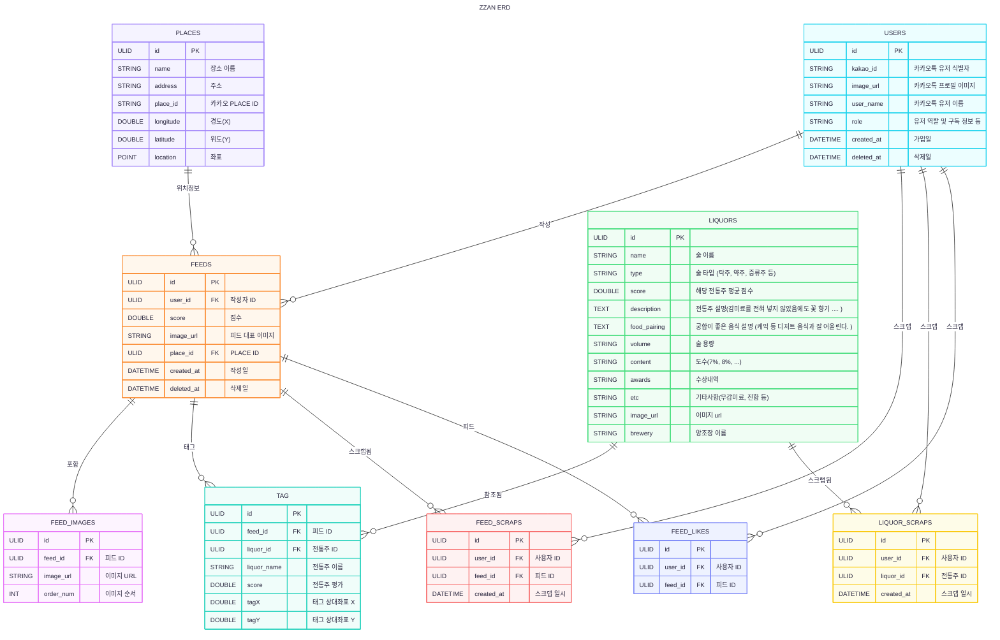

```mermaid
---
config:
  layout: dagre
  theme: redux-color
title: ZZAN ERD
---

erDiagram
    FEED_IMAGES {
        ULID id PK
        ULID feed_id FK "피드 ID"
        STRING image_url "이미지 URL"
        INT order_num "이미지 순서"
    }
    TAG {
        ULID id PK
        ULID feed_id FK "피드 ID"
        ULID liquor_id FK "전통주 ID"
        STRING liquor_name "전통주 이름"
        DOUBLE score "전통주 평가"
        DOUBLE tagX "태그 상대좌표 X"
        DOUBLE tagY "태그 상대좌표 Y"
    }
    FEEDS {
        ULID id PK
        ULID user_id FK "작성자 ID"
        DOUBLE score "점수"
        STRING image_url "피드 대표 이미지"
        ULID place_id FK "PLACE ID"
        DATETIME created_at "작성일"
        DATETIME deleted_at "삭제일"
    }
    USERS {
        ULID id PK
        STRING kakao_id "카카오톡 유저 식별자"
        STRING image_url "카카오톡 프로필 이미지"
        STRING user_name "카카오톡 유저 이름"
        STRING role "유저 역할 및 구독 정보 등"
        DATETIME created_at "가입일"
        DATETIME deleted_at "삭제일"
    }
    LIQUORS {
        ULID id PK
        STRING name "술 이름"
        STRING type "술 타입 (탁주, 약주, 증류주 등)"
        DOUBLE score "해당 전통주 평균 점수"
        TEXT description "전통주 설명(감미료를 전혀 넣지 않았음에도 꽃 향기 .... )"
        TEXT food_pairing "궁합이 좋은 음식 설명 (케익 등 디저트 음식과 잘 어울린다. )"
        STRING volume "술 용량"
        STRING content "도수(7%, 8%, ...)"
        STRING awards "수상내역"
        STRING etc "기타사항(무감미료, 진함 등)"
        STRING image_url "이미지 url"
        STRING brewery "양조장 이름"
    }
    PLACES {
        ULID id PK
        STRING name "장소 이름"
        STRING address "주소"
        STRING place_id "카카오 PLACE ID"
        DOUBLE longitude "경도(X)"
        DOUBLE latitude "위도(Y)"
        POINT location "좌표"
    }
    FEED_SCRAPS {
        ULID id PK
        ULID user_id FK "사용자 ID"
        ULID feed_id FK "피드 ID"
        DATETIME created_at "스크랩 일시"
    }
    LIQUOR_SCRAPS {
        ULID id PK
        ULID user_id FK "사용자 ID"
        ULID liquor_id FK "전통주 ID"
        DATETIME created_at "스크랩 일시"
    }
    FEED_LIKES {
        ULID id PK
        ULID user_id FK "사용자 ID"
        ULID feed_id FK "피드 ID"
    }

    USERS ||--o{ FEEDS: "작성"
    PLACES ||--o{ FEEDS: "위치정보"
    FEEDS ||--o{ FEED_IMAGES: "포함"
    FEEDS ||--o{ TAG: "태그"
    LIQUORS ||--o{ TAG: "참조됨"
    USERS ||--o{ FEED_SCRAPS: "스크랩"
    FEEDS ||--o{ FEED_SCRAPS: "스크랩됨"
    USERS ||--o{ LIQUOR_SCRAPS: "스크랩"
    USERS ||--o{ FEED_LIKES: "스크랩"
    FEEDS ||--o{ FEED_LIKES: "피드"
    LIQUORS ||--o{ LIQUOR_SCRAPS: "스크랩됨"


```
