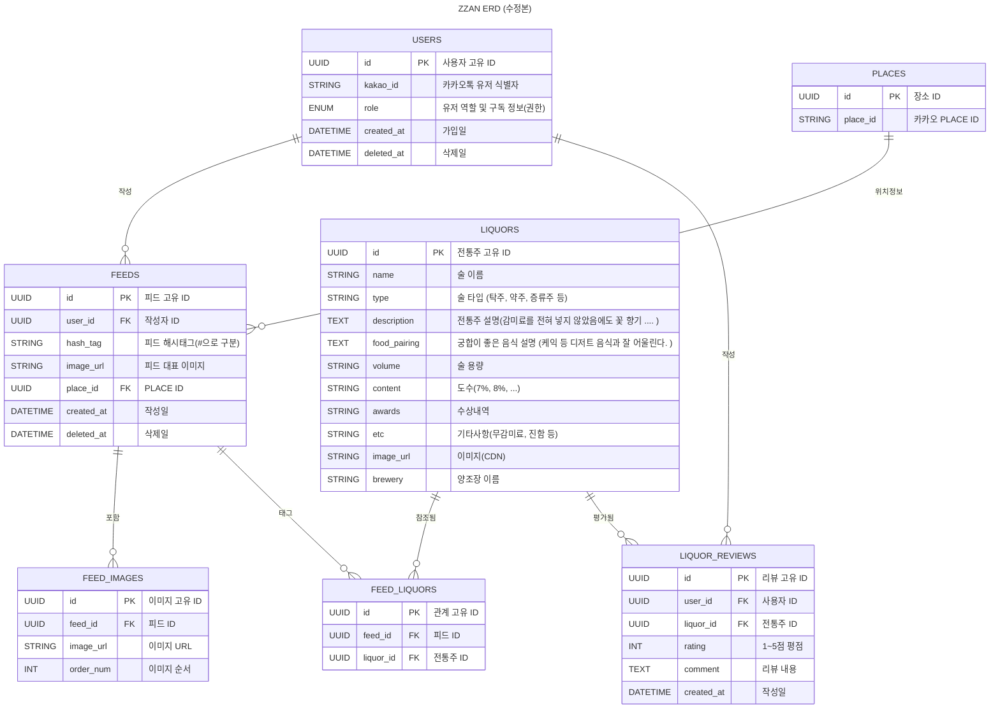

```mermaid

---
config:
layout: elk
theme: redux-color
title: ZZAN ERD (수정본)
---

erDiagram
direction TB
FEED_IMAGES {
UUID id PK "이미지 고유 ID"  
UUID feed_id FK "피드 ID"  
STRING image_url  "이미지 URL"  
INT order_num  "이미지 순서"  
}
FEED_LIQUORS {
UUID id PK "관계 고유 ID"  
UUID feed_id FK "피드 ID"  
UUID liquor_id FK "전통주 ID"  
}
LIQUOR_REVIEWS {
UUID id PK "리뷰 고유 ID"  
UUID user_id FK "사용자 ID"  
UUID liquor_id FK "전통주 ID"  
INT rating  "1~5점 평점"  
TEXT comment  "리뷰 내용"  
DATETIME created_at  "작성일"  
}
FEEDS {
UUID id PK "피드 고유 ID"  
UUID user_id FK "작성자 ID"  
STRING hash_tag  "피드 해시태그(#으로 구분)"  
STRING image_url  "피드 대표 이미지"  
UUID place_id FK "PLACE ID"  
DATETIME created_at  "작성일"  
DATETIME deleted_at  "삭제일"  
}
USERS {
UUID id PK "사용자 고유 ID"  
STRING kakao_id  "카카오톡 유저 식별자"  
ENUM role  "유저 역할 및 구독 정보(권한)"  
DATETIME created_at  "가입일"  
DATETIME deleted_at  "삭제일"  
}
LIQUORS {
UUID id PK "전통주 고유 ID"  
STRING name  "술 이름"  
STRING type  "술 타입 (탁주, 약주, 증류주 등)"  
TEXT description  "전통주 설명(감미료를 전혀 넣지 않았음에도 꽃 향기 .... )"  
TEXT food_pairing  "궁합이 좋은 음식 설명 (케익 등 디저트 음식과 잘 어울린다. )"  
STRING volume  "술 용량"  
STRING content  "도수(7%, 8%, ...)"  
STRING awards  "수상내역"  
STRING etc  "기타사항(무감미료, 진함 등)"  
STRING image_url  "이미지(CDN)"  
STRING brewery  "양조장 이름"  
}
PLACES {
UUID id PK "장소 ID"  
STRING place_id  "카카오 PLACE ID"  
}

	USERS||--o{FEEDS:"작성"
	PLACES||--o{FEEDS:"위치정보"
	FEEDS||--o{FEED_IMAGES:"포함"
	FEEDS||--o{FEED_LIQUORS:"태그"
	LIQUORS||--o{FEED_LIQUORS:"참조됨"
	USERS||--o{LIQUOR_REVIEWS:"작성"
	LIQUORS||--o{LIQUOR_REVIEWS:"평가됨"

```